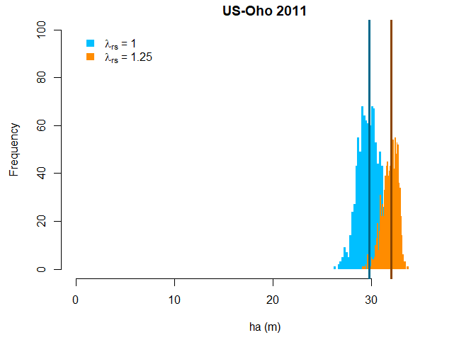

Workflow (forest example)
================
Housen Chu
2018-04-26

This documnet demostrates the calculation of aerodynamic canopy height at a forest site [US-Oho](http://ameriflux.lbl.gov/sites/siteinfo/US-Oho). Briefly, the calculation is done at a annual step using data of the 3 month full-foliated period. The *Schaudt and Dickinson* \[2000\] model (SD00) is used to generate 1000 pairs of z0/h and d/h for calculating 1000 estimates of aerodynamic canopy heights. Two output files contain estimates from with and without roughness sublayer corrections, respectively.

### Required packages and functions

``` r
require(car)
require(MASS)
source("hc_ddb2.R")
source("z0dhc.ratio.gen.R")
source("math_util.R")
```

### Workflow Control parameters

The following parameters are used to control the workflow, including model selection, LAI source, length of full-foliated season, number of simulations.

``` r
mdl.ver <- "SD00"      # "R94", "SD00", or "FIXED" 
shuffle.run <- T      # resample data or not (TRUE/FALSE) when estimation ha, this is intended for error propagation 
plot.output <- T      # output plot (TRUE/FALSE)
file.output <- T      # output file (TRUE/FALSE)
lai.rs.use <- F       # first use Remote sensing LAI (TRUE) or BADM LAI (FALSE), LAI specified as below
grw.mo <- 3           # specify lenth of growing season in month, default as 3 months (~91 days based on RS.LAI)
sim.N <- 1000         # number of simulation for z0/h & d/h
```

### Site parameters

The following parameters are site-specific, including the SITE ID, year, LAI, resolution of data files, filtering thresholds of USTAR, WD, and the starting/ending dates of the target period (e.g., full-foliated).

``` r
case <- "US-Oho_2011"            # 6-digit Fluxnet/AmeriFlux Site ID (CC-XXX), 4-digit year, separate by "_" 
res <- "HH"                      # Temporal resolution of the flux/met file ("HH"/"HR"), half-hourly/hourly
ustr.u <- 1.0                    # upper bound of accepted USTAR (m/s)  
ustr.l <- 0.2                    # lower bound of accepted USTAR (m/s)
wd.u <- 0                        # upper bound of accepted WD (degree)
wd.l <- 90                       # lower bound of accepted WD (degree)
lai <- 4                         # LAI based on BADM
lai.rs <- 2.90                   # LAI based on Remote-Sensing product 
lai.i <- 144                     # starting date of full-foliated season, pre-processed based on Remote-Sensing LAI
lai.f <- 240                     # ending date of full-foliated season, pre-processed based on Remote-Sensing LAI
k <- 0.4                         # von Karman constant (0.4)
nos<-length(case)                # number of case, don't modify
d.hr <- ifelse(res=="HH",48,24)  # handle hourly/half-hourly data, don't modify
```

### Data input/output

Data were downloaded through the [AmeriFlux](ameriflux.lbl.gov), including half-hourly horizontal wind speed, wind direction, friction velocity, and Monin-Obukhov length. All wind and turbulent data have gone through the standard quality checks as adopted by AmeriFlux and FLUXNET \[*Pastorello et al.*, 2014; *Pastorello et al.*, 2017\].

``` r
# read in pre-procesed/quality-controlled file 
data.org<-read.table(paste(DataDir,case,".csv",sep=""),header=T,sep=",",na.string=c("-9999"))
data.org[1:3,]
```

    ##     YR DOY  HR Time.id USTAR_1  WS_1 W_SIGMA_1 MO_LENGTH_1    WD_1 z0d hc
    ## 1 2011   1 0.5    2011   0.586 3.256        NA    329.6391 351.775  NA NA
    ## 2 2011   1 1.0    2011   0.585 3.142        NA    399.7268 344.295  NA NA
    ## 3 2011   1 1.5    2011   0.468 2.889        NA    271.4243 355.389  NA NA
    ##   zm_1
    ## 1   32
    ## 2   32
    ## 3   32

``` r
# maximun of zm within the data period, 
#   this is used for setting the upper bound of accepted ha estimation in hc_ddb2 function
zmax<-max(data.org$zm_1,na.rm=T)

# prepare a composite table for storing output annual ha (without roughness sublayer correction)
#   with all sim.N estimates 
hc.com.out<-data.frame(SITE_ID = substr(case,start=1,stop=6),                    # 6-digit SITE ID
                       YR = as.numeric(substr(case,start=8,stop=nchar(case))),   # Year of estimate
                       zm.max = zmax,                                            # max measurement height in the data period    
                       N.ddb = NA,                                               # N of data available after all filtering
                       Nin.ddb = NA)                                             # N of data record in original file
hc.com.out<-cbind(hc.com.out,matrix(NA,nos,sim.N))                               # sim.N columns for storing all calculated ha

# prepare a composite table for storing output annual ha (with roughness sublayer correction)
hc.com.out2<-hc.com.out 

# A subset of data used for further analysis
data.pre<-data.frame(DOY = data.org$DOY,                # Date of the year (1-366)
                     WS = data.org$WS_1,                # the mean wind speed (m/s)
                     USTAR = data.org$USTAR_1,          # friction velocity (m/s)
                     MO_LENGTH = data.org$MO_LENGTH_1,  # Obukhov length L (m) 
                     zm = data.org$zm_1,                # measurement height of WS, USTAR (m)
                     WD = data.org$WD_1)                # wind direction (degree from north)  
data.pre[1:3,]
```

    ##   DOY    WS USTAR MO_LENGTH zm      WD
    ## 1   1 3.256 0.586  329.6391 32 351.775
    ## 2   1 3.142 0.585  399.7268 32 344.295
    ## 3   1 2.889 0.468  271.4243 32 355.389

### Data filtering

Following the practices in *Pennypacker and Baldocchi* \[2015\], a series of criteria were applied to filter data as follows:

1.  Only data having wind direction from the preferred wind sector are used. Unless instructed otherwise by the site teams, the preferred wind sector is defined based on the prevailing wind direction (+/-45º) at each site.
2.  Data are also excluded during periods that have low or high friction velocity. Except in a few cases where other ranges have been deemed more appropriate, the accepted ranges for friction velocity are 0.2-0.6 and 0.2-1.0 m s-1 for short-vegetation and forest sites, respectively.
3.  Only data under the near neutral condition are used (|(zm-d)/L| &lt; 0.1, L: Monin-Obukhov length).
4.  A (half-)hourly record is treated as all missing if any of the required variables (i.e., wind speed, wind direction, friction velocity, Monin-Obukhov length) are missing for the (half-)hour.

For the forest sites, we focused on the full-foliage period of each year and estimated canopy heights at an annual time step. The full-foliage periods were determined as the three consecutive months that had the highest LAI in the multiyear mean seasonal cycles (i.e., MOD15A2H LAI C6). Such a three-month window was applied to both deciduous and evergreen forests.

``` r
# filtering data by setting USTAR thresholds
data.pre[!is.na(data.pre$USTAR)&data.pre$USTAR<ustr.l,c("USTAR","WS","MO_LENGTH")]<-NA
data.pre[!is.na(data.pre$USTAR)&data.pre$USTAR>ustr.u,c("USTAR","WS","MO_LENGTH")]<-NA

# filtering data by setting WD thresholds 
if(!is.na(wd.l)&!is.na(wd.u)){
  if(wd.l<wd.u){
    data.pre[!is.na(data.pre$WD)&data.pre$WD<wd.l,c("USTAR","WS","MO_LENGTH")]<-NA
    data.pre[!is.na(data.pre$WD)&data.pre$WD>wd.u,c("USTAR","WS","MO_LENGTH")]<-NA
  }else{
    data.pre[!is.na(data.pre$WD)&(data.pre$WD<wd.l&data.pre$WD>wd.u),c("USTAR","WS","MO_LENGTH")]<-NA
  }
}

# filtering data by setting MO_LENGTH thresholds
data.pre[!is.na(data.pre$MO_LENGTH)&data.pre$MO_LENGTH>1000,c("USTAR","WS","MO_LENGTH")]<-NA
data.pre[!is.na(data.pre$MO_LENGTH)&data.pre$MO_LENGTH<(-1000),c("USTAR","WS","MO_LENGTH")]<-NA

# adjust full-foliated season length, default as 3 months if not specified  
grw.mo.adj<-ceiling((90-grw.mo*30)/2)
doy.i<-ifelse(!is.na(lai.i),lai.i+grw.mo.adj,152+grw.mo.adj)
doy.f<-ifelse(!is.na(lai.f),lai.f-grw.mo.adj,243-grw.mo.adj)

# select the target full-foliated months
data.pre2<-data.pre[data.pre$DOY>=doy.i&data.pre$DOY<=doy.f,c("WS","USTAR","MO_LENGTH","zm")]
```

### Main calculation for aerodynamic canopy height

At each annual time step, the aerodynamic canopy heights were processed as follows:

1.  All post-filtered data for the three-month full-foliated period of a year were pooled together.
2.  One thousand pairs of coef1 (i.e., z0/h) and coef2 (i.e., d/h) were generated by `z0dhc.ratio.gen.R`, using the reported yearly LAI.
3.  Given each pair of coef1 and coef2, the aerodynamic canopy height for each (half-)hour of post-filtered data was calculated using `hc_ddb2.R`. The median of the calculated aerodynamic canopy heights for the three-month period was kept as one estimate.
4.  The post-filtered data were resampled with repeats. The steps 3-4 were iterated for 1000 times and generated 1000 estimates of aerodynamic canopy heights.
5.  The median of the 1000 estimates is treated as the best estimate and used for most of the following analyses, while the 95% percentile range (2.5%, 97.5%) is reported as the uncertainty interval. The 95% percentile range could be interpreted as propagated uncertainties regarding the choice of coef1 and coef2 and the random measurement errors of wind and turbulent data (through resampling the data).

``` r
# Generate sim.N pairs of z0/h, d/h based on the selected model and prescribed LAI  
#   the sequence of LAI preference is controlled by lai.rs.use
if(lai.rs.use){ # use RS-based LAI first
  z0dhc.ratio<-z0dhc.ratio.gen(LAI=ifelse(!is.na(lai.rs),lai.rs,lai),
                               sim.N=sim.N,mdl.default=mdl.ver)  
}else{  # use site-specific LAI first
  z0dhc.ratio<-z0dhc.ratio.gen(LAI=ifelse(!is.na(lai),lai,lai.rs),
                               sim.N=sim.N,mdl.default=mdl.ver)  
}

for(n in 1:sim.N){
  if(shuffle.run){
    if(n==1){
      shuffle.ls2<-c(1:nrow(data.pre2))  # original data set
    }else{
      shuffle.ls2<-sort(sample(c(1:nrow(data.pre2)),replace=T))  # shuffle with replacement
    }
  }else{
    shuffle.ls2<-c(1:nrow(data.pre2))  # original data set
  }  
  # ha estimation (without roughness sublayer correction)
  hc.ddb2.hold<-hc_ddb2(data.pre2[shuffle.ls2,],
                        zmax=zmax,
                        d.hr=d.hr,
                        coef1=z0dhc.ratio[n,1],
                        coef2=z0dhc.ratio[n,2],
                        lamda=1,
                        zm.cut=T)
  
  # ha estimation (with roughness sublayer correction)
  hc.ddb2.hold2<-hc_ddb2(data.pre2[shuffle.ls2,],
                         zmax=zmax,
                         d.hr=d.hr,
                         coef1=z0dhc.ratio[n,1],
                         coef2=z0dhc.ratio[n,2],
                         lamda=1.25,
                         zm.cut=T)
  
  hc.com.out[1,n+5]<-hc.ddb2.hold[[1]]
  hc.com.out2[1,n+5]<-hc.ddb2.hold2[[1]]
  hc.com.out$N.ddb<-hc.ddb2.hold[[9]]
  hc.com.out2$N.ddb<-hc.ddb2.hold2[[9]]
  hc.com.out$Nin.ddb<-hc.ddb2.hold[[10]]
  hc.com.out2$Nin.ddb<-hc.ddb2.hold2[[10]]
}
```

### Example output plot



### Example output file

``` r
if(file.output){  
  # 1000 estimates of ha (without roughness sublayer correction)
  write.table(hc.com.out,paste(OutDir,case,"_yearly_grw",grw.mo,"mo_canopy-height1.csv",sep=""),
              sep=",",row.names=F)
    # 1000 estimates of ha (with roughness sublayer correction)
  write.table(hc.com.out2,paste(OutDir,case,"_yearly_grw",grw.mo,"mo_canopy-height2.csv",sep=""),
              sep=",",row.names=F)
  hc.com.out[1,1:40]
}
```

    ##   SITE_ID   YR zm.max N.ddb Nin.ddb        1        2        3        4
    ## 1  US-Oho 2011     32   752    4656 26.76062 29.69724 29.69867 30.12751
    ##          5        6        7        8        9       10       11       12
    ## 1 28.49352 30.28286 28.59953 30.58592 28.07405 30.61604 28.48429 31.33244
    ##         13       14       15       16       17       18       19       20
    ## 1 29.52671 28.41203 30.63379 29.16453 29.51081 29.42774 30.57865 28.90018
    ##         21       22       23       24       25       26       27      28
    ## 1 27.98084 29.66421 30.83574 29.31831 31.54312 30.94922 27.39263 29.6512
    ##         29       30       31       32       33       34      35
    ## 1 29.06669 31.07994 30.46601 29.11572 29.67319 29.22199 30.3672
