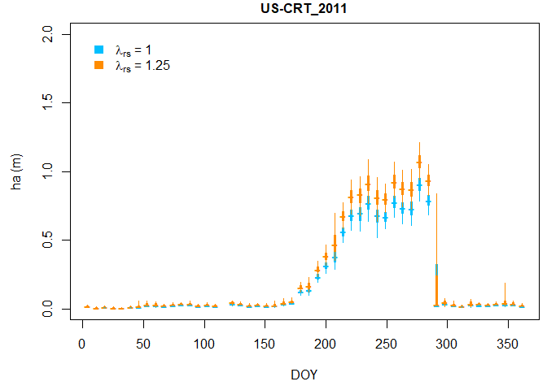

Workflow (cropland example)
================
Housen Chu
2018-04-26

This documnet demostrates the calculation of aerodynamic canopy height at a cropland site [US-CRT](http://ameriflux.lbl.gov/sites/siteinfo/US-CRT). Briefly, the calculation is done at a weekly step using data for an entire year. The *Raupach* \[1994\] model (R94) is used to generate 1000 pairs of z0/h and d/h for calculating 1000 estimates of aerodynamic canopy heights. Two output files contain estimates from with and without roughness sublayer corrections, respectively.

### Required packages and functions

``` r
require(car)
require(MASS)
source("hc_ddb2.R")
source("z0dhc.ratio.gen.R")
source("math_util.R")
```

### Workflow control parameters

The following parameters are used to control the workflow, including model selection, length of estimation window (e.g., 7 days), number of simulations.

``` r
mdl.ver <- "R94"      # "R94", "SD00", or "FIXED" 
shuffle.run <- T      # resample data or not (TRUE/FALSE) when estimation ha, this is intended for error propagation 
plot.output <- T      # output plot (TRUE/FALSE)
file.output <- T      # output file (TRUE/FALSE)
lwd<-7                # width of window (days) in estimating ha
sim.N <- 1000         # number of simulation for z0/h & d/h
```

### Site parameters

The following parameters are site-specific, including the SITE ID, year, resolution of data files, filtering thresholds of USTAR, WD.

``` r
case <- "US-CRT_2011"            # 6-digit Fluxnet/AmeriFlux Site ID (CC-XXX), 4-digit year, separate by "_" 
res <- "HH"                      # Temporal resolution of the flux/met file ("HH"/"HR"), half-hourly/hourly
ustr.u <- 0.6                    # upper bound of accepted USTAR (m/s)  
ustr.l <- 0.1                    # lower bound of accepted USTAR (m/s)
wd.u <- 247.5                    # upper bound of accepted WD (degree)
wd.l <- 337.5                    # lower bound of accepted WD (degree)
k <- 0.4                         # von Karman constant (0.4)
nos<-length(case)                # number of case
d.hr <- ifelse(res=="HH",48,24)  # handle hourly/half-hourly data
```

### Data input/output

Data were downloaded through the [AmeriFlux](ameriflux.lbl.gov), including half-hourly horizontal wind speed, wind direction, friction velocity, and Monin-Obukhov length. All wind and turbulent data have gone through the standard quality checks as adopted by AmeriFlux and FLUXNET \[*Pastorello et al.*, 2014; *Pastorello et al.*, 2017\].

``` r
# read in pre-procesed/quality-controlled file 
data.org<-read.table(paste(DataDir,case,".csv",sep=""),header=T,sep=",",na.string=c("-9999"))
data.org[1:3,]
```

    ##     YR DOY  HR Time.id USTAR_1 WS_1 W_SIGMA_1 MO_LENGTH_1 WD_1 z0d hc zm_1
    ## 1 2011   1 0.5    2011      NA   NA        NA          NA   NA  NA NA    2
    ## 2 2011   1 1.0    2011      NA   NA        NA          NA   NA  NA NA    2
    ## 3 2011   1 1.5    2011      NA   NA        NA          NA   NA  NA NA    2

``` r
# maximun of zm within the data period, 
#   this is used for setting the upper bound of accepted ha estimation in hc_ddb2 function
zmax<-max(data.org$zm_1,na.rm=T)

n.doy<-ceiling(nrow(data.org)/(lwd*d.hr)) # counts of windows for entire dataset
recs<-nrow(data.org); # number of records
cwd<-floor(nrow(data.org)/(lwd*d.hr)) ## counts of windows for entire dataset

# A subset of data used for further analysis
data.pre<-data.frame(DOY = data.org$DOY,                # Date of the year (1-366)
                     WS = data.org$WS_1,                # the mean wind speed (m/s)
                     USTAR = data.org$USTAR_1,          # friction velocity (m/s)
                     MO_LENGTH = data.org$MO_LENGTH_1,  # Obukhov length L (m) 
                     zm = data.org$zm_1,                # measurement height of WS, USTAR (m)
                     WD = data.org$WD_1)                # wind direction (degree from north)  
data.pre[1:3,]
```

    ##   DOY WS USTAR MO_LENGTH zm WD
    ## 1   1 NA    NA        NA  2 NA
    ## 2   1 NA    NA        NA  2 NA
    ## 3   1 NA    NA        NA  2 NA

``` r
# prepare a composite table for storing output weekly ha (without roughness sublayer correction)
#   with all sim.N estimates 
hc.doy.out<-data.frame(SITE_ID = rep(substr(case,start=1,stop=6),cwd),  # 6-digit SITE ID
                       DOY = data.pre$DOY[lwd*d.hr*(c(1:cwd)-0.5)],     # Central date of the year of estimate
                       zm = data.pre$zm[lwd*d.hr*(c(1:cwd)-0.5)],       # max measurement height over the window period   
                       N.ddb = rep(NA,cwd),                             # N of data available after all filtering
                       Nin.ddb = rep(NA,cwd))                           # N of data record in original file
hc.doy.out<-cbind(hc.doy.out,matrix(NA,nrow(hc.doy.out),sim.N))         # sim.N columns for storing all calculated ha 

# prepare a composite table for storing output annual ha (with roughness sublayer correction)
hc.doy.out2<-hc.doy.out 
```

### Data filtering

Following the practices in *Pennypacker and Baldocchi* \[2015\], a series of criteria were applied to filter data as follows:

1.  Only data having wind direction from the preferred wind sector are used. Unless instructed otherwise by the site teams, the preferred wind sector is defined based on the prevailing wind direction (+/-45º) at each site.
2.  Data are also excluded during periods that have low or high friction velocity. Except in a few cases where other ranges have been deemed more appropriate, the accepted ranges for friction velocity are 0.2-0.6 and 0.2-1.0 m s-1 for short-vegetation and forest sites, respectively.
3.  Only data under the near neutral condition are used (|(zm-d)/L| &lt; 0.1, L: Monin-Obukhov length).
4.  A (half-)hourly record is treated as all missing if any of the required variables (i.e., wind speed, wind direction, friction velocity, Monin-Obukhov length) are missing for the (half-)hour.

``` r
# filtering data by setting USTAR thresholds
data.pre[!is.na(data.pre$USTAR)&data.pre$USTAR<ustr.l,c("USTAR","WS","MO_LENGTH")]<-NA
data.pre[!is.na(data.pre$USTAR)&data.pre$USTAR>ustr.u,c("USTAR","WS","MO_LENGTH")]<-NA

# filtering data by setting WD thresholds
if(!is.na(wd.l)&!is.na(wd.u)){
  if(wd.l<wd.u){
    data.pre[!is.na(data.pre$WD)&data.pre$WD<wd.l,c("USTAR","WS","MO_LENGTH")]<-NA
    data.pre[!is.na(data.pre$WD)&data.pre$WD>wd.u,c("USTAR","WS","MO_LENGTH")]<-NA
  }else{
    data.pre[!is.na(data.pre$WD)&(data.pre$WD<wd.l&data.pre$WD>wd.u),c("USTAR","WS","MO_LENGTH")]<-NA
  }
}

# filtering data by setting MO_LENGTH thresholds
data.pre[!is.na(data.pre$MO_LENGTH)&data.pre$MO_LENGTH>1000,c("USTAR","WS","MO_LENGTH")]<-NA
data.pre[!is.na(data.pre$MO_LENGTH)&data.pre$MO_LENGTH<(-1000),c("USTAR","WS","MO_LENGTH")]<-NA
```

### Main calculation for aerodynamic canopy height

At each weekly time step, the aerodynamic canopy heights were processed as follows:

1.  All post-filtered data for the three-month full-foliated period of a year were pooled together.
2.  One thousand pairs of coef1 (i.e., z0/h) and coef2 (i.e., d/h) were generated by `z0dhc.ratio.gen.R`. Here, we chose a pair of fixed values for the distribution means of z0/h and d/h in `z0hc.ratio.gen.R` (e.g., 0.11 and 0.56 for R94 model). These values were determined based on the model relation of z0/h and d/h in the low LAI range (i.e., 0-1 m2 m-2), within which the canopy heights change most drastically and the z0/h-d/h relation could be approximated by a constant ratio.
3.  Given each pair of coef1 and coef2, the aerodynamic canopy height for each (half-)hour of post-filtered data was calculated using `hc_ddb2.R`. The median of the calculated aerodynamic canopy heights for the three-month period was kept as one estimate.
4.  The post-filtered data were resampled with repeats. The steps 3-4 were iterated for 1000 times and generated 1000 estimates of aerodynamic canopy heights.
5.  The median of the 1000 estimates is treated as the best estimate and used for most of the following analyses, while the 95% percentile range (2.5%, 97.5%) is reported as the uncertainty interval. The 95% percentile range could be interpreted as propagated uncertainties regarding the choice of coef1 and coef2 and the random measurement errors of wind and turbulent data (through resampling the data).

``` r
# no LAI input, function uses default LAI = 0.5
z0dhc.ratio2<-z0dhc.ratio.gen(sim.N=sim.N,mdl.default=mdl.ver)  

for(h in 1:cwd){ # loop through the windows
  
  # Moving & overlapping windows, size of "lwd",
  # Center at "cen", span +- 0.5*DOY.wd, Move 1*lwd each iteration
  cen<-lwd*d.hr*(h-1)+0.5*lwd*d.hr
  ini.wd<-cen-0.5*lwd*d.hr+1
  end.wd<-cen+0.5*lwd*d.hr
  
  data.in<-data.pre[c(ini.wd:end.wd),]
  
  for(n1 in 1:sim.N){
    if(shuffle.run){
      if(n1==1){
        shuffle.ls<-c(1:nrow(data.in))  # original data set
      }else{
        shuffle.ls<-sort(sample(c(1:nrow(data.in)),replace=T))  # shuffle with replacement
      }
    }else{
      shuffle.ls<-c(1:nrow(data.in))  # original data set
    }
    
    # ha estimation (without roughness sublayer correction)
    hc.ddb2.hold<-hc_ddb2(data.in[shuffle.ls,c("WS","USTAR","MO_LENGTH","zm")],
                          zmax=max(data.in$zm,na.rm=T),
                          d.hr=d.hr,
                          coef1=z0dhc.ratio2[n1,1],
                          coef2=z0dhc.ratio2[n1,2],
                          lamda=1,
                          zm.cut=T)
    hc.doy.out[h,n1+5]<-hc.ddb2.hold[[1]]
    
    # ha estimation (with roughness sublayer correction)
    hc.ddb2.hold2<-hc_ddb2(data.in[shuffle.ls,c("WS","USTAR","MO_LENGTH","zm")],
                           zmax=max(data.in$zm,na.rm=T),
                           d.hr=d.hr,
                           coef1=z0dhc.ratio2[n1,1],
                           coef2=z0dhc.ratio2[n1,2],
                           lamda=1.25,
                           zm.cut=T)
    hc.doy.out2[h,n1+5]<-hc.ddb2.hold2[[1]]
    
    if(n1==1){
      hc.doy.out$N.ddb[h]<-hc.ddb2.hold[[9]]
      hc.doy.out2$N.ddb[h]<-hc.ddb2.hold2[[9]]
      hc.doy.out$Nin.ddb[h]<-hc.ddb2.hold[[10]]
      hc.doy.out2$Nin.ddb[h]<-hc.ddb2.hold2[[10]]  
    }
  }
}
```

### Example output plot



### Example output file

``` r
if(file.output){
  # 1000 estimates of ha (without roughness sublayer correction), weekly time steps
  write.table(hc.doy.out,paste(OutDir,case,"_",lwd,"d","_canopy-height1.csv",sep=""),sep=",",row.names=F)
  # 1000 estimates of ha (wit roughness sublayer correction), weekly time steps
  write.table(hc.doy.out2,paste(OutDir,case,"_",lwd,"d","_canopy-height2.csv",sep=""),sep=",",row.names=F)
  hc.doy.out[1:3,1:10]
}
```

    ##   SITE_ID DOY zm N.ddb Nin.ddb           1           2          3
    ## 1  US-CRT   4  2    20     336          NA          NA         NA
    ## 2  US-CRT  11  2    27     336 0.005079875 0.005614688 0.00959308
    ## 3  US-CRT  18  2    50     336 0.010730317 0.015479527 0.01029050
    ##             4           5
    ## 1 0.020313794          NA
    ## 2 0.005651974 0.007708911
    ## 3 0.009446563 0.009182688
